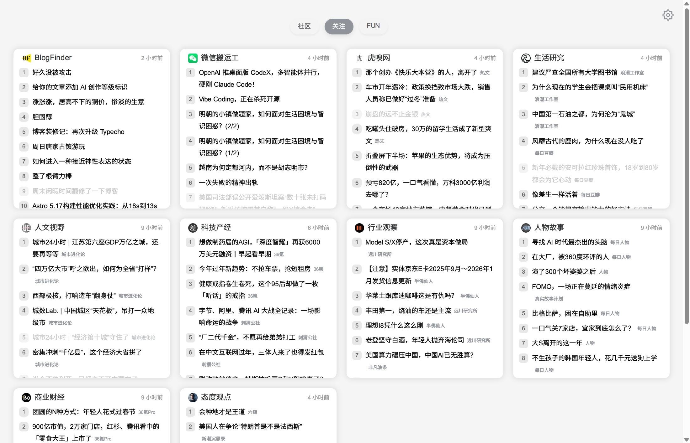
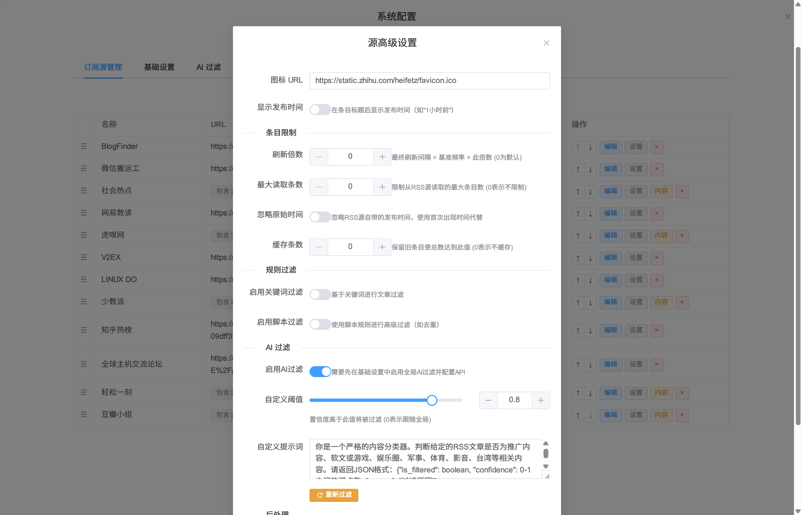

<div align="center">

# 🚀 Feedora

<p align="center">
  <strong>RSS 在线网页阅读器 - 轻量 · 智能 · 现代化</strong>
</p>

<p align="center">
  
  
  
  
</p>

<p align="center">
  一个功能强大的现代化 RSS 在线WEB阅读器，融合文件夹聚合、自动化内容处理（AI）、实时推送等特性。<br/>
  专为信息过载时代打造，助你高效获取真正有价值的内容。
</p>

</div>

---

## ✨ 核心特性

### 💎 现代化界面
- **卡片式** - 今日热榜卡片式界面，通过分组与文件夹聚合，高效阅读、组织和管理订阅源
- **响应式设计** - 完美适配桌面、平板、手机多端设备，支持切换深色模式
- **配置管理** - 内置强大的配置界面

### 🤖 智能过滤增强
- **关键词过滤** - 支持黑名单/白名单模式，精准控制内容
- **脚本过滤** - 通过 Bash/Shell 脚本实现高度自定义的过滤逻辑
- **AI内容过滤** - 基于大语言模型的智能分类，自动过滤低质内容、广告和推广文章
- **后处理增强** - AI/脚本 自动优化标题、提取链接
- **多 AI 平台支持** - 兼容 OpenAI、DeepSeek、豆包、智谱 AI、Ollama 等

### ⚡ 智能抓取
- **分时段抓取** - 根据不同时间段设置不同的刷新频率
- **倍率控制** - 为每个订阅源单独配置刷新倍率

### 🔒 稳定可靠
- **数据持久化** - 自动保存已读状态、条目缓存、处理记录
- **配置热更新** - 修改配置文件后自动生效，无需重启

---

## 📸 界面预览

<table>
<tr>
<td width="50%">

**桌面端界面**


</td>

</tr>
<tr>
<td colspan="2">

**配置管理界面**


</td>
</tr>
</table>

---

## 🚀 快速开始

### 前置要求

- Docker
- Docker Compose
- Git

### 一键部署

```bash
# 克隆项目
git clone https://github.com/SkeStars/feedora.git
cd feedora

# 启动服务
docker-compose up -d --build
```

服务将在 `http://localhost:8080` 启动。

### 开发模式

项目集成了 [Air](https://github.com/air-verse/air) 工具，支持代码修改后自动重载，无需重启容器：

```bash
# 使用开发模式启动
docker-compose -f docker-compose.dev.yml up --build
# 触发热重载
touch .reload
```

---

## 📖 使用指南

### 基础操作

- **标记已读** - 点击文章标题自动标记为已读，支持多设备记录同步
- **分组切换** - 顶栏点击分组名称切换视图，移动端可滑动切换
- **时间显示** - 点击卡片图标右上角时间切换显示条目时间
- **立即刷新** - 点击卡片右上角时间或者页面底部倒计时立即抓取源的最新内容

### 配置管理

- 部署成功后，点击页面右上角的 **⚙️ 齿轮图标**，输入设置的 `password` （默认为1234）即可进入管理后台。
- 设置抓取计划，优化资源使用和更新频率
- 快速添加、修改订阅源、通过拖拽调整顺序，轻松组织数十个订阅源
- 配置过滤与后处理规则，提升内容质量
---

## 📚 常见问题

<details>
<summary><b>Q: 如何添加新的订阅源？</b></summary>

有两种方式：
1. **可视化添加**：登录管理后台 → 点击"添加订阅源" → 填写信息 → 保存
2. **手动编辑**：编辑 `config.json` 文件 → 在 `sources` 数组中添加新源 → 保存（自动生效）
推荐 [DIYgod/RssHub](https://github.com/DIYgod/RssHub)、[decemberpei/Rss](https://github.com/decemberpei/Rss) 用于查找 RSS 源。

</details>

<details>
<summary><b>Q: AI 过滤不生效怎么办？</b></summary>

检查以下几点：
1. 确认 `aiFilter.enabled` 为 `true`
2. 检查 API Key 是否正确
3. 确认 API Base URL 与所用平台匹配
4. 查看 Docker 日志：`docker-compose logs -f`
5. 尝试清除缓存后重新抓取

</details>

<details>
<summary><b>Q: 脚本过滤报错怎么办？</b></summary>

1. 确保脚本语法正确
2. 在本地测试脚本：`echo '...' | bash script.sh`

</details>

<details>
<summary><b>Q: 如何备份数据？</b></summary>

重要数据存储在 `data/` 目录：
```bash
# 备份
cp -r data/ data_backup_$(date +%Y%m%d)/

# 恢复
cp -r data_backup_20260203/* data/
docker-compose restart
```

</details>

<details>
<summary><b>Q: 如何修改端口？</b></summary>

编辑 `docker-compose.yml`：
```yaml
ports:
  - "8888:8080"  # 外部端口:内部端口
```
然后重启：`docker-compose up -d`

</details>

---

## ⚙️ 配置详解

配置文件位于项目根目录的 `config.json`，支持丰富的功能配置。

### 全局配置
**配置示例：**

```json
{
  "sources":[],
  "schedules": [],
  "aiFilter": {},
  "password": "1234",
  "sessionDuration": 720,
  "nightStartTime": "22:00:00",
  "nightEndTime": "07:00:00",
  "darkMode": false,
  "groupOrder": ["科技", "资讯", "博客"],
  "defaultGroup": "科技"
}
```

| 字段 | 类型 | 必填 | 说明 |
|------|------|------|------|
| `sources` | array | ✓ | RSS 订阅源列表 |
| `schedules` | array | - | 抓取计划规则（可设置分时段刷新频率） |
| `aiFilter` | object | - | 全局 AI 配置 |
| `password` | string | - | 管理后台密码（留空则无需密码） |
| `sessionDuration` | number | - | 登录会话有效期（小时），默认 720 |
| `nightStartTime` | string | - | 夜间模式开始时间（HH:mm:ss） |
| `nightEndTime` | string | - | 夜间模式结束时间（HH:mm:ss） |
| `darkMode` | boolean | - | 手动开启深色模式（覆盖自动模式） |
| `groupOrder` | array | - | 顶栏分组排序 |
| `defaultGroup` | string | - | 默认显示的分组名称 |


### 订阅源配置 (sources)

示例 1：单源配置

```json
{
  "name": "技术博客",
  "url": "https://example.com/feed.xml",
  "icon": "https://example.com/favicon.ico"
}
```

示例 2：文件夹配置

```json
{
  "name": "科技媒体聚合",
  "icon": "https://example.com/tech-icon.png",
  "urls": [
    {
      "url": "https://techcrunch.com/feed/",
      "name": "TechCrunch"
    },
    {
      "url": "https://www.wired.com/feed/rss",
      "name": "Wired"
    }
  ]
}
```
每个订阅源支持以下配置：

| 字段 | 类型 | 必填 | 说明 |
|------|------|------|------|
| `url` | string | ✓ | RSS 订阅链接（单源模式必填） |
| `urls` | array | - | 子源列表（文件夹模式使用） |
| `name` | string | - | 订阅源名称 |
| `icon` | string | - | 自定义图标 URL |
| `group` | string | - | 所属分组名称 |
| `refreshCount` | number | - | 刷新倍率（实际间隔 = 基础间隔 × 倍率） |
| `maxItems` | number | - | 每次解析的最大条目数（0 为不限制） |
| `cacheItems` | number | - | 持久化缓存数量 |
| `ignoreOriginalPubDate` | boolean | - | 使用首次抓取时间排序 |
| `showPubDate` | boolean | - | 是否显示发布时间 |
| `filter` | object | - | 过滤规则配置 |
| `postProcess` | object | - | 后处理配置 |

### 抓取计划 (schedules)

支持在不同时段设置不同的刷新频率：

```json
{
  "schedules": [
    {
      "startTime": "08:00:00",
      "endTime": "23:00:00",
      "baseRefresh": 10,
      "defaultCount": 1
    },
    {
      "startTime": "23:00:00",
      "endTime": "08:00:00",
      "baseRefresh": 30,
      "defaultCount": 2
    }
  ]
}
```

| 字段 | 说明 |
|------|------|
| `startTime` | 时段开始时间（HH:mm:ss） |
| `endTime` | 时段结束时间（HH:mm:ss） |
| `baseRefresh` | 该时段的基础刷新间隔（分钟） |
| `defaultCount` | 该时段的默认倍率 |

**实际刷新间隔计算：**
```
实际间隔 = baseRefresh × (sources[i].refreshCount || defaultCount)
```

### 全局 AI 配置 (aiFilter)

全局 AI 配置示例：

```json
{
  "aiFilter": {
    "enabled": true,
    "apiKey": "your-api-key-here",
    "apiBase": "https://ark.cn-beijing.volces.com/api/v3",
    "model": "doubao-seed-1-8-251228",
    "systemPrompt": "你是一个严格的内容分类器。判断给定的RSS文章是否为推广内容、软文、低质内容等。返回JSON格式：{\"is_filtered\": boolean, \"confidence\": 0-1之间的浮点数, \"reason\": \"过滤原因\"}",
    "threshold": 0.7,
    "maxTokens": 500,
    "temperature": 0.1,
    "timeout": 30,
    "concurrency": 5
  }
}
```

| 字段 | 说明 | 默认值 |
|------|------|--------|
| `enabled` | 是否全局启用 AI 过滤 | `false` |
| `apiKey` | API 密钥 | - |
| `apiBase` | API 端点（兼容 OpenAI 格式） | 火山引擎 |
| `model` | 模型名称 | - |
| `systemPrompt` | 系统提示词 | - |
| `threshold` | 过滤阈值（0-1），超过此置信度才过滤 | `0.7` |
| `maxTokens` | 最大 token 数 | `500` |
| `temperature` | 温度参数 | `0.1` |
| `timeout` | 请求超时时间（秒） | `30` |
| `concurrency` | 并发请求数 | `3` |

**支持的 AI 平台：**
- OpenAI
- DeepSeek
- 豆包（火山引擎）
- 阿里云百炼
- 智谱 AI
- Ollama（本地部署）

### 过滤规则 (filter)

支持关键词、脚本、AI三种过滤方式，可组合使用：

```json
{
  "filter": {
    "keywordEnabled": true,
    "filterKeywords": ["广告", "推广", "赞助"],
    "keepKeywords": ["开源", "技术"],
    "whitelistMode": false,
    
    "scriptFilterEnabled": true,
    "scriptFilterContent": "jq '[.[] | select(.title | contains(\"特定词\"))]'",

    "aiEnabled": true,
    "threshold": 0.8,
    "customPrompt": "..."
  }
}
```

| 字段 | 类型 | 说明 |
|------|------|------|
| `keywordEnabled` | boolean | 启用关键词过滤 |
| `filterKeywords` | array | 黑名单关键词（匹配则过滤） |
| `keepKeywords` | array | 白名单关键词（匹配则保留，优先级高） |
| `whitelistMode` | boolean | 严格白名单模式（仅保留匹配白名单的） |
| `aiEnabled` | boolean | 对该源启用 AI 过滤 |
| `threshold` | number | 该源的 AI 过滤阈值 |
| `customPrompt` | string | 自定义 AI 提示词（覆盖全局） |
| `scriptFilterEnabled` | boolean | 启用脚本过滤 |
| `scriptFilterContent` | string | Bash 脚本内容 |

### 后处理配置 (postProcess)

后处理可用于生成摘要、提取原文链接、修改标题等：

```json
{
  "postProcess": {
    "enabled": true,
    "mode": "llm",
    "prompt": "请为这篇文章生成50字以内的精简摘要",
    "modifyTitle": false,
    "modifyLink": false,
    "modifyPubDate": false
  }
}
```

**LLM 模式：**
| 字段 | 类型 | 说明 |
|------|------|------|
| `mode` | string | 设置为 `"llm"` |
| `prompt` | string | AI 处理提示词 |
| `modifyTitle` | boolean | 是否允许修改标题 |
| `modifyLink` | boolean | 是否允许修改链接 |
| `modifyPubDate` | boolean | 是否允许修改发布时间 |

**脚本模式：**
| 字段 | 类型 | 说明 |
|------|------|------|
| `mode` | string | 设置为 `"script"` |
| `scriptContent` | string | 内联 Bash 脚本 |
| `scriptPath` | string | 外部脚本文件路径 |

**脚本示例（提取微信公众号原文链接）：**

```bash
#!/bin/bash
input=$(cat)
title=$(echo "$input" | jq -r '.title' | sed 's/ | 原文$//')
desc=$(echo "$input" | jq -r '.description')
link=$(echo "$desc" | grep -oE 'https://mp\.weixin\.qq\.com/s/[^"<>&]+' | head -1)

jq -n --arg title "$title" --arg link "$link" '{title: $title, link: $link}'
```

---

## 🔧 脚本扩展指南

### 过滤脚本

**输入格式：** 标准输入接收条目 JSON 数组
```json
[
  {
    "title": "文章标题",
    "link": "https://example.com",
    "description": "文章描述"
  }
]
```

**输出格式：** 标准输出返回过滤后的 JSON 数组

**示例 1：过滤包含特定关键词的文章**
```bash
jq '[.[] | select(.title | contains("广告") | not)]'
```

**示例 2：只保留标题长度大于10的文章**
```bash
jq '[.[] | select(.title | length > 10)]'
```

**示例 3：使用正则表达式过滤**
```bash
jq '[.[] | select(.title | test("^\\[.*\\]"; "i") | not)]'
```

### 后处理脚本

**输入格式：** 标准输入接收单个条目 JSON 对象
```json
{
  "title": "文章标题",
  "link": "https://example.com",
  "description": "文章描述",
  "pubDate": "2026-02-03T12:00:00Z"
}
```

**输出格式：** 标准输出返回包含修改字段的 JSON 对象
```json
{
  "title": "新标题",
  "link": "https://new-link.com",
  "pubDate": "2026-02-03T12:00:00Z"
}
```

**示例 1：提取微信公众号原文链接**
```bash
#!/bin/bash
input=$(cat)
title=$(echo "$input" | jq -r '.title')
desc=$(echo "$input" | jq -r '.description')
link=$(echo "$desc" | grep -oE 'https://mp\.weixin\.qq\.com/s/[^"<>&]+' | head -1)

jq -n --arg title "$title" --arg link "$link" '{title: $title, link: $link}'
```

**示例 2：为链接添加追踪参数**
```bash
#!/bin/bash
input=$(cat)
link=$(echo "$input" | jq -r '.link')
new_link="${link}?from=feedora"

jq -n --arg link "$new_link" '{link: $link}'
```

**示例 3：清理标题格式**
```bash
#!/bin/bash
input=$(cat)
title=$(echo "$input" | jq -r '.title' | sed 's/^【.*】//' | sed 's/^\[.*\]//')

jq -n --arg title "$title" '{title: $title}'
```

---

## 🌐 Nginx 反向代理

**推荐配置：**

```nginx
server {
    listen 443 ssl http2;
    server_name rss.example.com;
    
    ssl_certificate /path/to/fullchain.cer;
    ssl_certificate_key /path/to/private.key;
    
    # 启用 Gzip 压缩
    gzip on;
    gzip_types text/plain text/css application/json application/javascript 
               text/xml application/xml application/xml+rss text/javascript;
    gzip_min_length 1000;
    
    # 主应用
    location / {
        proxy_pass http://localhost:8080;
        proxy_set_header Host $host;
        proxy_set_header X-Real-IP $remote_addr;
        proxy_set_header X-Forwarded-For $proxy_add_x_forwarded_for;
        proxy_set_header X-Forwarded-Proto $scheme;
    }
    
    # WebSocket 支持
    location /ws {
        proxy_pass http://localhost:8080/ws;
        proxy_http_version 1.1;
        proxy_set_header Upgrade $http_upgrade;
        proxy_set_header Connection "Upgrade";
        proxy_set_header Host $host;
        proxy_read_timeout 300s;  # 防止 WebSocket 超时断开
        proxy_send_timeout 300s;
    }
}

# HTTP 重定向到 HTTPS
server {
    listen 80;
    server_name rss.example.com;
    return 301 https://$host$request_uri;
}
```

**重要说明：**
- `proxy_read_timeout` 必须设置较大值（如 300s），否则 WebSocket 会在默认 60 秒后断开
- 启用 Gzip 可显著减少传输数据量
- 建议启用 HTTP/2 提升性能

---

## 🏗️ 项目结构

```
feedora/
├── main.go              # 主程序入口
├── config.json          # 配置文件
├── go.mod              # Go 模块依赖
├── Dockerfile          # Docker 镜像构建
├── docker-compose.yml  # Docker Compose 配置
├── models/             # 数据模型
│   ├── config.go       # 配置结构
│   └── feed.go         # Feed 数据结构
├── utils/              # 工具函数
│   ├── feed.go         # Feed 抓取处理
│   ├── llm.go          # AI 过滤与后处理
│   ├── persistence.go  # 数据持久化
│   └── postprocess.go  # 后处理逻辑
├── globals/            # 全局变量与静态资源
│   ├── global.go
│   └── static/         # 前端静态文件
└── data/               # 数据存储目录
    ├── read_state.json         # 已读状态
    ├── items_cache.json        # 条目缓存
    ├── filter_cache.json       # 过滤缓存
    ├── postprocess_cache.json  # 后处理缓存
    └── ranking_timestamps.json # 热榜时间戳
```

---

## 🤝 贡献指南

欢迎提交 Issue 和 Pull Request！

- feat: 新功能
- fix: 修复 bug
- docs: 文档更新
- style: 代码格式调整
- refactor: 代码重构
- test: 测试相关
- chore: 构建/工具链相关

---

## 📄 开源协议

本项目采用 [MIT License](LICENSE) 开源协议。

---

## 🙏 致谢

本项目使用了以下优秀的开源项目：
- [srcrs/rss-reader](https://github.com/srcrs/rss-reader) - 项目来源
- [Go](https://golang.org/) - 高效的编程语言
- [gofeed](https://github.com/mmcdole/gofeed) - RSS/Atom 解析库
- [gorilla/websocket](https://github.com/gorilla/websocket) - WebSocket 实现
- [Vue.js](https://vuejs.org/) - 前端框架
- [Sortable.js](https://sortablejs.github.io/Sortable/) - 拖拽排序
- [Air](https://github.com/air-verse/air) - 热重载工具

---

## 📮 联系方式

- GitHub Issues: [提交问题](https://github.com/SkeStars/feedora/issues)
- 项目地址: [https://github.com/SkeStars/feedora](https://github.com/SkeStars/feedora)

---

<div align="center">

**如果这个项目对你有帮助，请给个 ⭐️ Star 支持一下！**

Made with ❤️ by SkeStars

</div>
